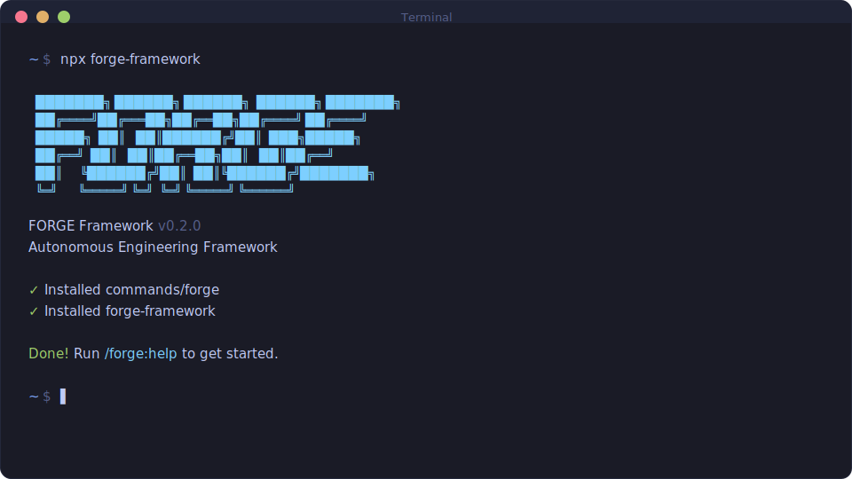

<div align="center">

# FORGE

**Autonomous Engineering Framework** — structured plan/apply/verify/unify loop with pluggable test flows, git history retrofit, and real-time project dashboard for Claude Code.

[](https://www.npmjs.com/package/forge-framework)
[](LICENSE)
[](https://github.com/SanthoshVishnuRajamanickam/forge-framework)

<br>

```bash
npx forge-framework
```

**Works on Mac, Windows, and Linux.**

<br>



<br>

*"Discover, don't interrogate. Evidence before claims. Tiers are slots, not implementations."*

<br>

[Why Forge](#why-forge) · [Getting Started](#getting-started) · [The Loop](#the-loop) · [Commands](#commands) · [Test Flows](#test-flows) · [Retrofit](#retrofit) · [Dashboard](#dashboard)

</div>

---

## Why Forge

Building with Claude Code is powerful — until context rots, plans orphan, and you spend more time managing AI output than shipping features.

Forge fixes this with **four principles:**

1. **Loop integrity** — Every plan closes with UNIFY. No orphan plans. UNIFY reconciles what was planned vs what happened, updates state, and logs decisions. This is the heartbeat.

2. **Pluggable test architecture** — 10 test tiers (static, unit, integration, e2e, MCP-driven, visual, performance, security, platform, manual), each bound to configurable executors (CLI commands, skills, MCP servers, or human checklists). The AI can test itself via MCP tools — no scripts needed.

3. **Mid-project adoption** — Most frameworks assume greenfield. Forge's retrofit command reverse-engineers your project state from git history, tags, and changelogs. Join any project mid-flight without starting over.

4. **Evidence-driven development** — Acceptance criteria are first-class. Every task requires `<verify>` criteria. CARL rules enforce plan validation, blocker sync, and transition commits. Confidence without evidence is not completion.

---

## Who This Is For

**Engineers who use AI to ship** — web apps, mobile apps, embedded firmware, APIs, CLIs, libraries. Forge adapts to your stack, not the other way around.

- **Solo developers** — structured loop keeps you on track across sessions
- **Teams adopting AI** — shared state, decision logs, handoff files
- **Complex stacks** — Qt + Android + dSPACE HIL? Forge's platform tier handles cross-device test orchestration
- **Regulated industries** — ISO 26262 / DO-178C safety traceability, MC/DC coverage reporting

You describe what you want, Claude Code builds it, and Forge ensures:
- Plans have clear acceptance criteria before execution starts
- Every task is qualified against the spec — not just executed and assumed correct
- Tests run automatically at the right time (per-task, per-checkpoint, per-phase, per-milestone)
- State persists across sessions with handoff files
- Decisions are logged for future reference

---

## Getting Started

```bash
npx forge-framework
```

The installer prompts for location:
- **Global** (`~/.claude/`) — available in all projects
- **Local** (`./.claude/`) — current project only

Pass `--global` or `--local` to skip the prompt.

> Re-running the installer is safe: existing files are backed up to `*.backup-<timestamp>` before new files are written.

### New Project

```
/forge:init              # scaffold .forge/ with conversational setup
/forge:milestone         # define the first milestone
/forge:discuss           # explore the first phase
/forge:plan              # write a PLAN.md
/forge:apply             # execute the approved plan
/forge:verify            # user-acceptance test the output
/forge:unify             # reconcile plan vs actual
/forge:complete-milestone  # finalize once all phases are done
```

### Existing Project

```
/forge:retrofit              # reverse-engineer FORGE state from git history
/forge:retrofit --mode=full  # + phase reconstruction from commit patterns
```

Retrofit analyzes package metadata, git tags, changelogs, and commit patterns to auto-populate `.forge/` — then presents confidence-scored findings for approval before writing anything.

### Between Sessions

```
/forge:pause      # write HANDOFF + WIP commit
/forge:resume     # restore from HANDOFF
/forge:progress   # see suggested next action
/forge:dashboard  # full project state at a glance
```

---

## The Loop

```
PLAN ──▶ APPLY ──▶ VERIFY ──▶ UNIFY ──╮
  ╰──────────────────────────────────────╯
```

| Phase | What happens |
|-------|-------------|
| **PLAN** | Write PLAN.md with objective, acceptance criteria, tasks, boundaries. Approval required before APPLY. |
| **APPLY** | Execute tasks with Execute/Qualify loop. Static + unit tests run per-task. Integration tests at checkpoints. |
| **VERIFY** | E2E, MCP-driven, visual, performance, security, and manual tests run. TEST-REPORT.md generated. |
| **UNIFY** | Reconcile plan vs actual. Update STATE.md. Log deviations. Transition commit. Route to next phase. |

CARL rules enforce the loop: no code without a plan (RULE_2), every task needs `<verify>` (RULE_7), blockers sync to STATE.md (RULE_5), one commit per phase at transition (RULE_11).

---

## Commands

32 commands organized by workflow stage:

| Category | Commands |
|----------|----------|
| **Core Loop** | `init`, `plan`, `apply`, `verify`, `unify` |
| **Session** | `pause`, `resume`, `progress`, `handoff`, `dashboard` |
| **Milestones** | `milestone`, `complete-milestone`, `discuss-milestone`, `add-phase`, `remove-phase` |
| **Pre-Planning** | `discuss`, `assumptions`, `discover`, `research`, `research-phase` |
| **Quality** | `verify`, `audit`, `plan-fix`, `consider-issues`, `test`, `debug` |
| **Specialized** | `flows`, `config`, `map-codebase`, `retrofit`, `register` |

Run `/forge:help` for the full reference.

---

## Test Flows

Forge includes a pluggable test architecture with **10 tiers** and **4 executor types**.

### Tiers

| Tier | When | Gate |
|------|------|------|
| static | Per-task (before unit) | Task completion |
| unit | Per-task | Task completion |
| integration | At checkpoints | Checkpoint |
| e2e | VERIFY phase | Phase completion |
| mcp-driven | VERIFY phase | Phase completion |
| visual | VERIFY phase | Phase completion |
| performance | VERIFY / checkpoint | Phase completion |
| security | VERIFY phase | Phase completion |
| platform | Milestone | Milestone completion |
| manual | VERIFY phase | Phase completion |

### Executors

Each tier binds to one or more executors:

| Type | Example | How it works |
|------|---------|-------------|
| **CLI** | `npm test`, `pytest`, `ctest` | FORGE runs command, reads exit code + output |
| **Skill** | `/playwright-cli` | FORGE invokes skill, reads structured result |
| **MCP** | Playwright, PSIX, dSPACE | AI uses MCP tools directly — no scripts, AC *are* the test spec |
| **Manual** | Human checklist | FORGE generates checklist from acceptance criteria |

### Get Started with Testing

```
/forge:test brainstorm    # guided discovery: what to test and how
/forge:test configure     # lock in test profile
/forge:test               # run all enabled tiers
/forge:test report        # show latest TEST-REPORT.md
```

See [assets/test-flows.html](assets/test-flows.html) for the interactive architecture diagram.

---

## Retrofit

Initialize Forge on a project that's been running for months or years:

```
/forge:retrofit              # standard: 4 agents map codebase + milestones from tags
/forge:retrofit --mode=full  # + history agent reconstructs phases from commits
/forge:retrofit --resume     # resume interrupted retrofit
/forge:retrofit --refine=history  # re-run only the history agent
```

**How it works:**
1. Auto-detects project identity (package metadata, git tags, language)
2. Detects workflow shape (standard, squash-merge, trunk-based, rebase)
3. Spawns parallel agents: codebase map (sonnet) + git history analysis (haiku)
4. Parses CHANGELOG as primary source (higher fidelity than git alone)
5. Pre-processes: bot filter, fork detector, secret scanner
6. Presents confidence-scored findings for approval
7. Writes `.forge/` files only after explicit approval

See [assets/retrofit-flow.html](assets/retrofit-flow.html) for the flow diagram.

---

## Dashboard

One command, complete situational awareness:

```
/forge:dashboard         # terminal output
/forge:dashboard --html  # interactive HTML at .forge/dashboard.html
```

Shows: project identity, milestone progress, loop position, test profile status, special flows, git health, blockers, and suggested next action.

---

## Architecture

```
src/
  commands/     32 slash commands (/forge:*)
  workflows/    execution playbooks (plan-phase, apply-phase, etc.)
  references/   shared knowledge (test-flows, git-strategy, retrofit-history)
  templates/    file templates for .forge/ state
  rules/        invariant definitions
  carl/         CARL rule manifest (12 rules, RFC 2119 levels)
```

**CARL** (Context-Anchored Rule Loader) enforces invariants:

| Level | Rules | Examples |
|-------|-------|---------|
| MUST | 1–6 | Load before execute, no code without plan, APPLY→UNIFY |
| SHOULD | 7–9 | Verify criteria required, log deviations, BDD format |
| MAY | 10–12 | Context budgets, commit format, decimal phases for interrupts |

---

## Attribution

Forge's core plan/apply/unify loop is built on patterns from [Chris Kahler's](https://github.com/ChristopherKahler) work on structured AI-assisted development. The test flow architecture, retrofit system, dashboard, CARL rule enforcement, and all v0.2.0 additions are original work.

## License

MIT — see [LICENSE](LICENSE).
