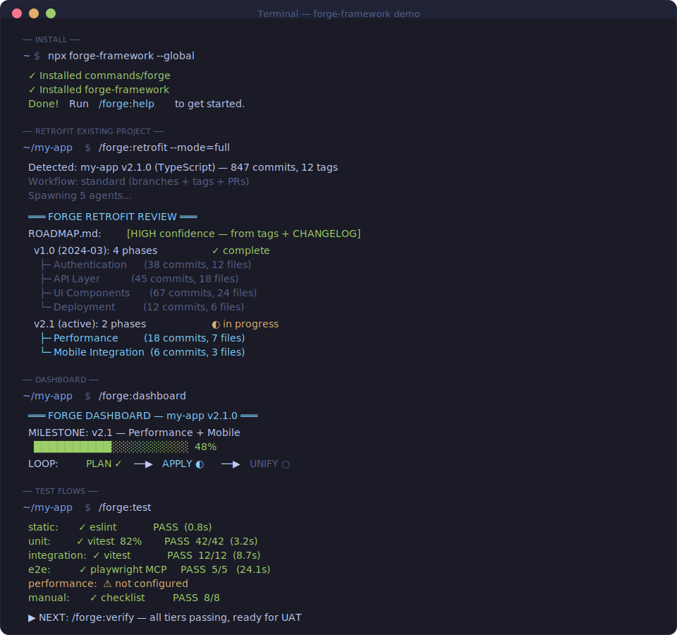

<div align="center">

# FORGE

**Stop managing AI output. Ship verified features.**

[](https://www.npmjs.com/package/forge-framework)
[](LICENSE)
[](https://github.com/SanthoshVishnuRajamanickam/forge-framework)

```bash
npx forge-framework
```



</div>

---

## The Problem

Claude Code generates fast. But without structure, plans orphan, context rots, and you spend more time fixing AI output than shipping. Forge gives your team a repeatable loop: **plan it, build it, verify it, close it.**

---

## Your First Loop

```bash
/forge:init     # scaffold project
/forge:plan     # write the plan
/forge:apply    # build it
/forge:verify   # test it
/forge:unify    # close the loop
```

---

## The Loop

```
PLAN ──▶ APPLY ──▶ VERIFY ──▶ UNIFY ──╮
  ╰──────────────────────────────────────╯
```

| Phase | What happens |
|-------|-------------|
| **PLAN** | Write PLAN.md with objective, tasks, and acceptance criteria. Approval required. |
| **APPLY** | Execute tasks. Tests run per-task. |
| **VERIFY** | E2E, manual, and MCP-driven tests. TEST-REPORT.md generated. |
| **UNIFY** | Reconcile plan vs actual. Update state. Log deviations. Close the loop. |

---

## Core Commands

| Command | What it does |
|---------|-------------|
| `/forge:init` | Scaffold `.forge/` and set up project |
| `/forge:plan` | Write PLAN.md with tasks + acceptance criteria |
| `/forge:apply` | Execute the approved plan |
| `/forge:verify` | Run tests, UAT, confirm it works |
| `/forge:unify` | Reconcile plan vs actual, close the loop |

32 commands total. Run `/forge:help` or see [CHEATSHEET.md](CHEATSHEET.md) for the full reference.

---

## Install

### Option A: npm

```bash
npx forge-framework              # interactive
npx forge-framework --global     # install to ~/.claude/
npx forge-framework --local      # install to ./.claude/ (project only)
```

Update: `npx forge-framework@latest --global`

### Option B: Claude Code Plugin (auto-updates)

Add to `~/.claude/settings.json`:

```json
{
  "extraKnownMarketplaces": {
    "forge-framework": {
      "source": { "source": "github", "repo": "SanthoshVishnuRajamanickam/forge-framework" }
    }
  },
  "enabledPlugins": {
    "forge-framework@forge-framework": true
  }
}
```

Restart Claude Code. All `/forge:*` commands are available. Updates are automatic.

---

## Key Features

- **Loop integrity** — Every plan closes with UNIFY. No orphan plans, no drift.
- **Pluggable tests** — 10 tiers, 4 executor types (CLI, Skill, MCP, Manual). Configure per-project.
- **Mid-project adoption** — `forge:retrofit` reverse-engineers state from git history. Join any project mid-flight.
- **CARL enforcement** — 12 rules (RFC 2119 levels) prevent plan drift, missing tests, and state inconsistency.

---

## Learn More

- [CHEATSHEET.md](CHEATSHEET.md) — One-page quick reference
- [Test Flows](src/references/test-flows.md) — Pluggable test architecture
- [Retrofit](src/references/retrofit-history.md) — Add Forge to existing projects
- Run `/forge:dashboard` for real-time project state
- Run `/forge:help` for all 32 commands

---

## Attribution

Forge's core plan/apply/unify loop is built on patterns from [Chris Kahler's](https://github.com/ChristopherKahler) work on structured AI-assisted development. The test flow architecture, retrofit system, dashboard, CARL rule enforcement, and all v0.2.0 additions are original work.

## License

MIT — see [LICENSE](LICENSE).
